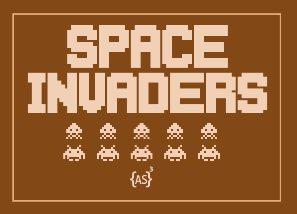
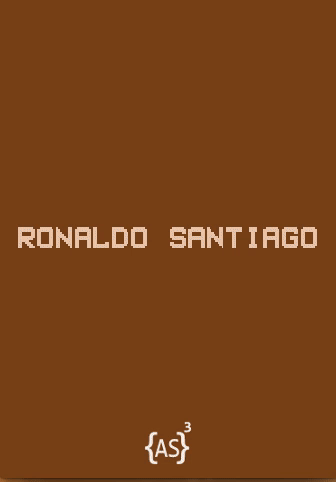
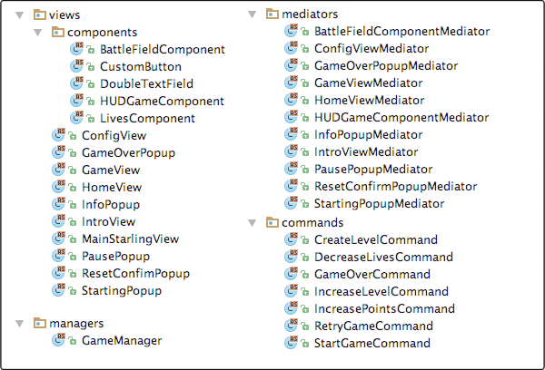
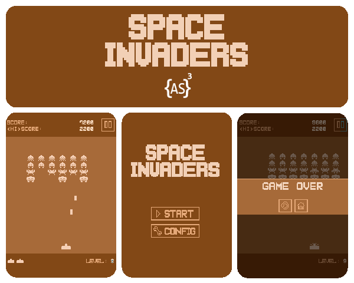

This is an ActionScript open-source game which was developed to shows how to integrate Starling, Robotlegs, and Palidor.

+ **Category:** Arcade.
+ **Platform:** Web.
+ **Language:** ActionScript 3.
+ **Technologies:** StarlingFW, Robotlegs, Palidor.

* * *

### Gameplay



* * *

### Dependencies

+ [Starling](https://github.com/Gamua/Starling-Framework)
+ [Robotlegs 2](https://github.com/robotlegs/robotlegs-framework)
+ [Palidor](https://github.com/RonaldoSetzer/robotlegs-extensions-Palidor)


* * *


### Demo
+ **[ActionScript](https://ronaldosetzer.github.io/portfolio/open_source/space_invaders_as/)**
+ **[TypeScript](https://ronaldosetzer.github.io/portfolio/open_source/space_invaders_ts/)**


* * *

### Game

#### Game Flow


#### Views - Managers - Mediators - Commands




### Palidor Config

#### MVCConfig.as
```as3
public class MVCConfig implements IConfig
{
    ...

    private function mapMediators():void
	{
		mediatorMap.map( IntroView ).toMediator( IntroViewMediator );
		mediatorMap.map( HomeView ).toMediator( HomeViewMediator );
		mediatorMap.map( ConfigView ).toMediator( ConfigViewMediator );
		mediatorMap.map( GameView ).toMediator( GameViewMediator );

		mediatorMap.map( HUDGameComponent ).toMediator( HUDGameComponentMediator );
		mediatorMap.map( BattleFieldComponent ).toMediator( BattleFieldComponentMediator );

		mediatorMap.map( StartingPopup ).toMediator( StartingPopupMediator );
		mediatorMap.map( PausePopup ).toMediator( PausePopupMediator );
		mediatorMap.map( GameOverPopup ).toMediator( GameOverPopupMediator );
		mediatorMap.map( ResetConfimPopup ).toMediator( ResetConfirmPopupMediator );
		mediatorMap.map( InfoPopup ).toMediator( InfoPopupMediator );
	}

	private function mapFlowManager():void
	{
		flowManager.map( FlowEvent.SHOW_INTRO_VIEW ).toView( IntroView );
		flowManager.map( FlowEvent.SHOW_HOME_VIEW ).toView( HomeView );
		flowManager.map( FlowEvent.SHOW_GAME_VIEW ).toView( GameView );
		flowManager.map( FlowEvent.SHOW_CONIFG_VIEW ).toView( ConfigView );

		flowManager.map( FlowEvent.SHOW_STARTING_POPUP ).toFloatingView( StartingPopup );
		flowManager.map( FlowEvent.SHOW_PAUSE_POPUP ).toFloatingView( PausePopup );
		flowManager.map( FlowEvent.SHOW_GAME_OVER_POPUP ).toFloatingView( GameOverPopup );
		flowManager.map( FlowEvent.SHOW_RESET_CONFIRM_POPUP ).toFloatingView( ResetConfimPopup );
		flowManager.map( FlowEvent.SHOW_INFO_POPUP ).toFloatingView( InfoPopup );
	}

    ...
}

```

#### GameConfig.as

```as3
public class GameConfig implements IConfig
{
    ...

    private function mapModels():void
	{
		context.injector.map( GameModel ).asSingleton();
		context.injector.map( LevelModel ).asSingleton();
	}

	private function mapManager():void
	{
		context.injector.map( GameManager ).asSingleton();
		context.injector.map( SharedObjectManager ).asSingleton();
	}

	private function mapCommands():void
	{
		commandMap.map( GameEvent.START_GAME_COMMAND ).toCommand( StartGameCommand );
		commandMap.map( GameEvent.RETRY_GAME_COMMAND ).toCommand( RetryGameCommand );
		commandMap.map( GameEvent.CREATE_LEVEL_COMMAND ).toCommand( CreateLevelCommand );
		commandMap.map( GameEvent.INCREASE_LEVEL_COMMAND ).toCommand( IncreaseLevelCommand );
		commandMap.map( GameEvent.INCREASE_POINTS ).toCommand( IncreasePointsCommand );
		commandMap.map( GameEvent.DECREASE_LIVES ).toCommand( DecreaseLivesCommand );
		commandMap.map( GameEvent.GAME_OVER ).toCommand( GameOverCommand );
	}

	private function mapServices():void
	{
		context.injector.map( GameService ).asSingleton();
	}

    ...
}

```

* * *


### Screenshots

* * *

**Ronaldo Santiago**  - Game Developer [ [portfolio](https://ronaldosetzer.github.io/portfolio/) ]
