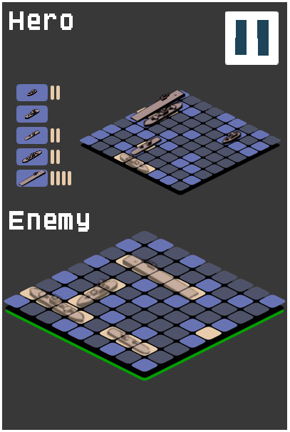

GAME-Battleship
===


[](https://travis-ci.org/RonaldoSetzer/GAME-Battleship)
[](https://codeclimate.com/github/RonaldoSetzer/GAME-Battleship/coverage)
[](https://github.com/prettier/prettier)

This is a TypeScript open-source game.



+ **Category:** Puzzle.
+ **Platform:** Web.
+ **Language:** TypeScript.
+ **Technologies:** PixiJS, RobotlegsJS, RobotlegsJS-Pixi, RobotlegsJS-Pixi-Palidor.


* * *

### Installation

```
npm install
npm run start
```

* * *

### Dependencies

+ [PixiJS](http://www.pixijs.com/)
+ [RobotlegsJS](https://github.com/RobotlegsJS/RobotlegsJS)
+ [Robotlegs-Pixi](https://github.com/RobotlegsJS/RobotlegsJS-Pixi)
+ [Robotlegs-Pixi-Palidor](https://github.com/RobotlegsJS/RobotlegsJS-Pixi-Palidor)

* * *

```
TODO:
1 - Animations
2 - Level Editor
3 - AI
```

* * *

**Ronaldo Santiago**  - Game Developer [ [portfolio](https://ronaldosetzer.github.io/portfolio/) ]