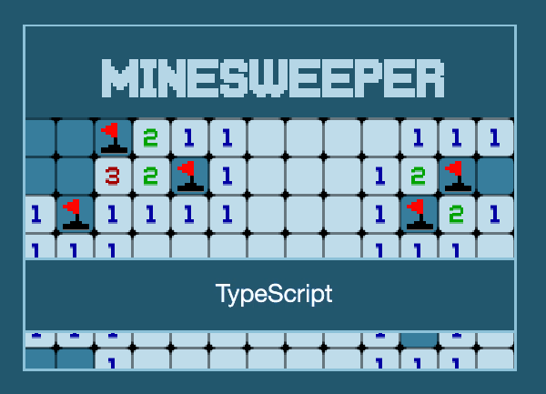
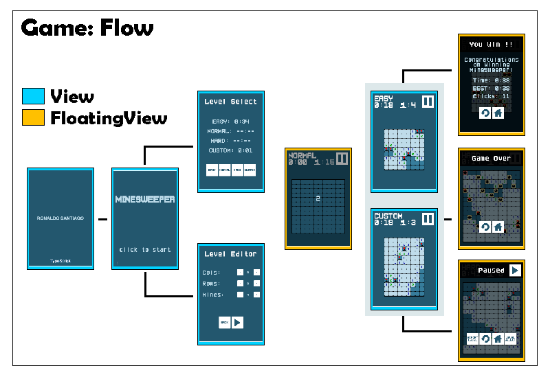
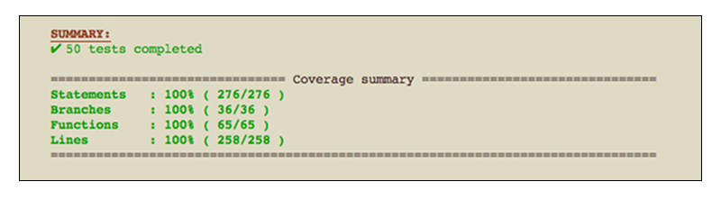

# GAME Minesweeper



* * *

This is a TypeScript open-source game.

+ **Category:** Puzzle.
+ **Platform:** Web.
+ **Language:** TypeScript.
+ **Technologies:** PixiJS, RobotlegsJS, RobotlegsJS-Pixi, RobotlegsJS-Pisi-Palidor.

* * *

## Gameplay


* * *

## Installation

Follow the [building the projects](https://github.com/RobotlegsJS/RobotlegsJS-Framework/tree/master/.github/CONTRIBUTING.md#building-the-projects) section to know how to setup your local development environment.

Then you can run this example using:

```bash
cd games/minesweeper
npm start
```

* * *

## Dependencies

+ [PixiJS](http://www.pixijs.com/)
+ [RobotlegsJS](https://github.com/RobotlegsJS/RobotlegsJS-Framework/tree/master/packages/core)
+ [RobotlegsJS-Pixi](https://github.com/RobotlegsJS/RobotlegsJS-Framework/tree/master/packages/pixi)
+ [RobotlegsJS-Pixi-Palidor](https://github.com/RobotlegsJS/RobotlegsJS-Framework/tree/master/packages/pixi-palidor)

## Game





* * *

## Screenshots


* * *

**Ronaldo Santiago**  - Game Developer [ [portfolio](https://ronaldosetzer.github.io/portfolio/) ]
