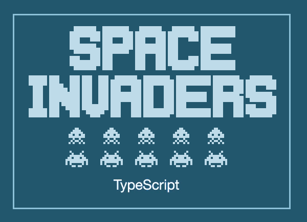
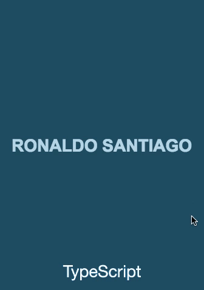
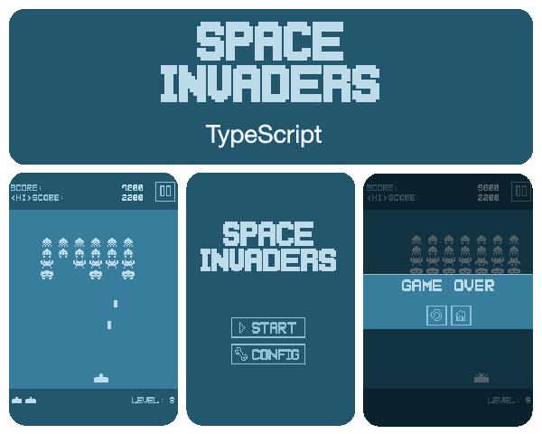

This is a TypeScript open-source game which is a port of the ActionScript version, following the same concepts, graphics, and architecture.

+ **Category:** Arcade.
+ **Platform:** Web.
+ **Language:** TypeScript.
+ **Technologies:** PixiJs, RobotlegsJS, RobotlegsJS-Pixi, RobotlegsJS-Pixi-Palidor.

* * *

### Gameplay

* * *

### Dependencies

+ [PixiJS](http://www.pixijs.com/)
+ [RobotlegsJS](https://github.com/RobotlegsJS/RobotlegsJS)
+ [RobotlegsJS-Pixi](https://github.com/RobotlegsJS/RobotlegsJS-Pixi)
+ [RobotlegsJS-Pixi-Palidor](https://github.com/RobotlegsJS/RobotlegsJS-Pixi-Palidor)

* * *

### Demos
+ **[ActionScript](https://ronaldosetzer.github.io/portfolio/open_source/space_invaders_as/)**
+ **[TypeScript](https://ronaldosetzer.github.io/portfolio/open_source/space_invaders_ts/)**

* * *

### Game

#### Game Flow

* * *

### Screenshots

* * *

**Ronaldo Santiago**  - Game Developer [ [portfolio](https://ronaldosetzer.github.io/portfolio/) ]
